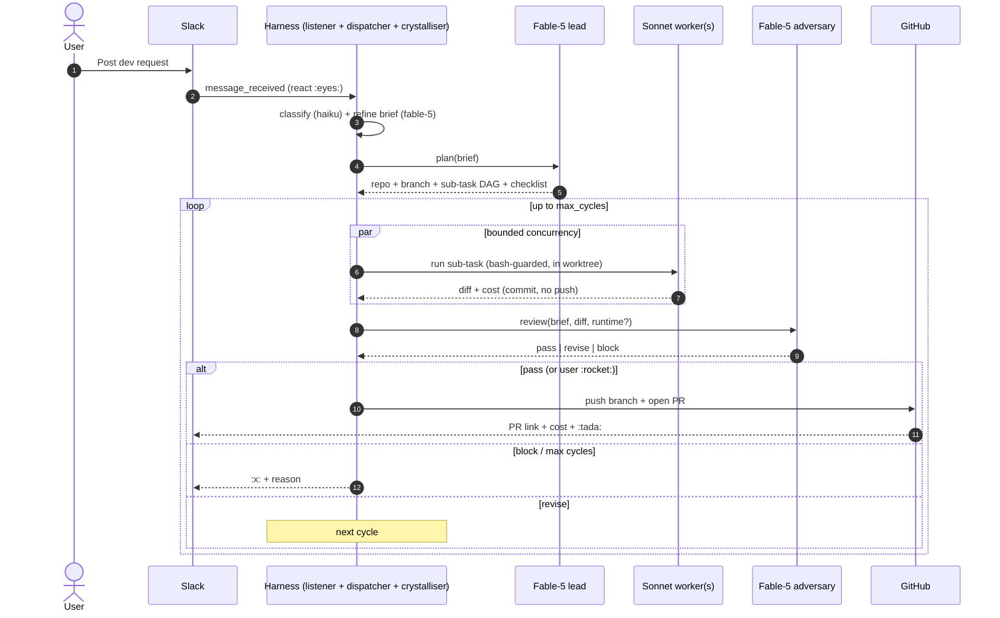

# openclaw-agent-harness

*Multi-agent code-writing harness for OpenClaw.* Hand it a dev request and a Fable-5 lead plans, Sonnet workers write code in isolated git worktrees, and a Fable-5 adversary reviews the diff (with optional runtime logs, see below) before a PR opens under the requester's GitHub identity.

> *Status: beta.* Version `0.1.0-beta.21`. 323 tests green. See `docs/REAL-TEST-RUNBOOK.md` before wiring up a live channel, **`docs/AUTH.md`** for the Anthropic API key and verification contract reference, and **`docs/GITHUB_AUTH.md`** for git provider tokens (GitHub + GitLab, per-user; required in a headless/Docker deployment, else the first session fails at plan phase).
>
> **beta.21:** OKF concept pass-through (`relevantConcepts` field on `harness_run` / `harness_start_session` propagates through crystalliser + lead + worker prompts). See [OKF integration](#okf-integration-optional) below.
> **beta.20:** README task-phrasing guide added (see [How to ask for work](#how-to-ask-for-work-task-phrasing-guide) below).
> **beta.19:** lead atomicity rule for write+commit and push+PR (avoids over-decomposition of atomic actions into separate sub-tasks); `sub_tasks.started_at` column populated.
> **beta.16-18:** verification telemetry (`baseRef`/`baseSemantics` on `verify_failed`), observe-mode audit breadcrumb, worktree pruning on terminal transitions with real physical removal, startup worktree self-heal, always-emit heal audit.
> **beta.14-15:** authoritative `contractScope` and `taskMode` plan fields that promote scope decisions to first-class (replacing regex-inference whack-a-mole).
> **beta.10:** the 5 new beta.9 optional verify probes are now provided by the production `buildVerifyProbes` factories in both the loop-path and worker-path. See [CHANGELOG](CHANGELOG.md) for the full arc.

### Two ways to drive it

- **Agent-orchestrated (DEFAULT, recommended).** The OpenClaw agent owns the conversation and calls the harness as a set of tools. You talk to your OpenClaw agent; it calls `harness_run` (raw request -> crystallise -> plan -> workers -> adversary -> PR), watches with `harness_status` / `harness_session_get`, and reports back. The plugin does **not** listen to Slack itself. This is the default (`slack.listener_enabled: false`).
- **Autonomous listener (opt-in).** Set `slack.listener_enabled: true` and the plugin subscribes to `message_received` and treats allow-listed messages in `slack.channel` as dev requests directly, bypassing the agent. Useful for a dedicated dev channel, but it competes with your OpenClaw agent for messages, so it's off by default.

Either way the pipeline is identical; only the *entry point* differs.

## How to ask for work: task-phrasing guide

The harness works best when your request tells the lead planner three things: *what* changes, *where* it belongs, and *how you'd know it worked*. There are two ways to do this — pick the one that matches the size of the ask.

### Tier 1: just talk to your OpenClaw agent

> Say what should change, what shouldn't, and how you'd know it worked. The crystalliser will ask if it's unclear. Trust it — clarifying questions save a $2 wasted run.

For small, well-scoped changes on a repo you know well, plain English works. Example:

> "On `carel/homelab-tools`, add a `--dry-run` flag to `scripts/backup.py` that skips actual `rsync` but prints what it would do. Don't touch the existing behaviour. Tests should still pass."

The crystalliser will structure that into a brief, hand it to the lead planner, and away it goes. If any of the fields (repo, done-when, out-of-scope) are ambiguous, the crystalliser will ask you before spending model tokens.

### Tier 2: structured template (recommended for larger repos)

On a big codebase (10K+ LOC) the lead planner can't hold the whole tree in context, so it needs *pointers*. Use this shape:

```
Task: <what you want done, one sentence>
Repo: <owner/repo>
Where: <specific files or directories where the change belongs>
Do NOT: <things not to touch — dependencies, unrelated files, refactors>
Done when:
  - <2-4 concrete acceptance criteria — the reviewer uses these>
Risk: low | medium | high
```

Every field is optional except `Task` and `Done when`. The others sharpen the plan; the more you provide, the less the lead has to guess.

### Golden rules for phrasing

A few phrasings that measurably affect plan quality (all learned the hard way through smoke tests):

1. *Keep atomic actions in one sentence.* "Append the line and commit locally" — not two bullets. The lead knows write+commit is one sub-task if you write it that way. Same for "push the branch and open a PR".
2. *Be explicit about out-of-scope.* "Do NOT touch `src/legacy/`, `package-lock.json`, or any dependencies." Reduces wandering more than any other single field.
3. *Anchor "done when" in observable facts.* "Tests pass" is weak. "`npm run test:integration` passes AND `docs/CHANGELOG.md` has a new entry" is strong — the reviewer can check both.
4. *Prefer local scope on small changes.* Say "No push, no PR" if you want to inspect the branch first. The plan will use `contractScope: 'local'` and skip the remote verification path.
5. *Name the risk honestly.* `high` risk widens the reviewer's checklist and triggers a stricter review pass. Don't downplay a schema migration as `low`.

### Four worked examples

**Bugfix.**
> Task: The retry logic in `src/lib/http/client.ts` doesn't reset the backoff counter on a successful request between failures. Fix it and add a regression test.
> Repo: carel/service-mesh
> Where: `src/lib/http/client.ts`, `tests/lib/http/client.test.ts`
> Do NOT: change the public API, touch other callers, refactor unrelated retry code in `src/lib/queue/`
> Done when: new test in `tests/lib/http/client.test.ts` reproduces the bug and passes; existing tests still pass; no changes outside the two files above
> Risk: low

Expected plan shape: 1 mutate sub-task (fix + test in one atomic write+commit), 1 observe sub-task (`verify:[]` sanity check), push+PR sub-task.

**Small feature.**
> Task: Add a `--json` output flag to `scripts/report.py` that emits the same data as machine-readable JSON.
> Repo: carel/homelab-tools
> Where: `scripts/report.py`, `tests/test_report.py`, `README.md` (usage section only)
> Do NOT: change the default (human) output, add new dependencies, touch `scripts/backup.py`
> Done when: `python scripts/report.py --json` emits valid JSON matching the fields in the human output; test in `tests/test_report.py` parses that output with `json.loads`; README has a one-line usage example
> Risk: low

Expected plan shape: 1-2 mutate sub-tasks (implementation + test + docs, atomic if phrased tightly), 1 observe, push+PR.

**Refactor.**
> Task: Extract the duplicated timestamp-formatting code (currently inline in 3 files under `src/handlers/`) into a shared helper in `src/util/time.ts`. Behaviour must be identical.
> Repo: carel/service-mesh
> Where: new file `src/util/time.ts`; existing files `src/handlers/{a,b,c}.ts`; tests under `tests/util/` and `tests/handlers/`
> Do NOT: change the timestamp *format* or the timezone handling; do NOT touch anything outside the four handler files or the new util; do NOT rename existing exports
> Done when: all three handlers import from `src/util/time.ts`; new `tests/util/time.test.ts` covers the helper; existing handler tests pass unchanged
> Risk: medium

Expected plan shape: multiple mutate sub-tasks (one per file or one for the util + one for all three handlers), 1 observe sub-task confirming call sites all delegate, push+PR. Higher risk widens the reviewer's checklist.

**Docs-only.**
> Task: Document the environment variables the harness needs, in a new `docs/ENV.md` file.
> Repo: CarelvanHeerden/openclaw-agent-harness
> Where: `docs/ENV.md` (new file only)
> Do NOT: change any code, config, or existing docs; do NOT list variables that aren't actually read by the codebase
> Done when: file exists with entries for `ANTHROPIC_API_KEY`, `GH_TOKEN`, `GITLAB_TOKEN`; each entry names the code path that reads it (grep for `process.env.<name>`); no other files changed
> Risk: low

Expected plan shape: 1 mutate sub-task (`taskMode:'mutate'`, `contractScope:'local'`), optional observe, push+PR. No test-related sub-tasks because there are no tests to run.

### What if the harness plans it wrong

If you see 3+ sub-tasks for what feels like one action — the lead is over-decomposing. React `:x:` to abort and re-phrase with tighter atomicity (rule #1 above). If sub-tasks fail verify with `commit_verify_failed` and the worker's own audit shows it produced no changes, that's almost always a split write+commit — same fix.

If the plan skips a file you meant to change, your `Where:` field probably wasn't specific enough. Re-run with an explicit path.

## OKF integration (optional)

If you drive the harness through an OpenClaw agent that has the OKF plugin installed, you get a free upgrade on large repos: the OpenClaw agent's context enrichment surfaces "Relevant Knowledge" concept blocks per request, and the agent can forward those into the harness via the `relevantConcepts` parameter on `harness_run` / `harness_start_session`.

Beta.21 threads these concept refs through the whole pipeline:

1. *Crystalliser* uses concept `path` values to seed `filesLikelyTouched` and concept `tags` as implicit `outOfScope` hints when they don't match the request domain.
2. *Lead planner* uses concept paths to anchor sub-task `filesLikelyTouched` on the right subsystem.
3. *Worker* system prompt includes the concept `content` (bounded at 4KB per concept) when the sub-task's likely-touched paths intersect the concept's path. This is the material win on 100K+ LOC repos where a worker would otherwise burn tokens rediscovering codebase structure.

Concept shape:

```typescript
interface OkfConceptRef {
  id: string;        // e.g. 'services/retry'
  path?: string;     // repo-relative path where the concept file lives
  summary?: string;  // one-line description
  tags?: string[];   // OKF tags
  content?: string;  // concept file body (markdown); auto-truncated at 4KB in worker prompts
}
```

All fields except `id` are optional. Callers that don't have OKF (or don't have relevant concepts for a given request) simply omit the parameter and behaviour matches beta.20.

## Why

Your OpenClaw agent is where dev asks land, and Claude Code is where the actual writing gets done. This plugin closes the loop: crystallise the ask into a brief, plan atomic sub-tasks, execute them in parallel Sonnet subprocesses inside a git worktree, and have a Fable-5 adversary sign off before a PR is opened. The agent orchestrates all of it via tools.

Nothing pushes to a repo until the adversary is satisfied (or a human drops `:rocket:` to override). Nothing pushes at all without a per-repo per-user PAT the requester owns.

## Architecture

Full UML (component, sequence, state) lives in [`docs/ARCHITECTURE.md` §0](docs/ARCHITECTURE.md#0-uml-diagrams). The interaction between the agents, at a glance:



Nothing pushes until the adversary passes (or a human drops `:rocket:`). Reactions (`:rocket:` ship, `:x:` abort, `:moneybag:` budget-bump) are polled every 15s and applied at each loop checkpoint.

## Subsystems (all wired)

| Piece                        | File                                             | Purpose                                                |
| ---------------------------- | ------------------------------------------------ | ------------------------------------------------------ |
| Plugin entry                 | `src/index.ts`                                   | OpenClaw plugin descriptor + `register(api)`           |
| Config parser                | `src/config.ts`                                  | Hard validation, deep-merge defaults                   |
| Config JSON schema           | `src/config.schema.json`                         | Editor / doc integration                               |
| PAT router                   | `src/auth/pat-router.ts`                         | Per-user, per-repo PAT resolution                      |
| Prompt crystalliser          | `src/crystallise/prompt-refiner.ts`              | Classifier -> brief pipeline                           |
| Fable-5 lead                 | `src/orchestrator/fable5-lead.ts`                | Plan validator (allow-list, branch prefix, sub-cap 20) |
| Sonnet worker                | `src/orchestrator/sonnet-worker.ts`              | Runs one sub-task with `canUseTool` guard              |
| Fable-5 adversary            | `src/orchestrator/fable5-adversary.ts`           | Reviews diff, runtime banner, safety-net              |
| Orchestrator loop            | `src/orchestrator/loop.ts`                       | 3-cycle state machine + parallel exec + topo sort      |
| Claude SDK adapter           | `src/adapters/claude-sdk.ts`                     | `@anthropic-ai/claude-agent-sdk` wrappers              |
| Git worktree adapter         | `src/adapters/git-worktree.ts`                   | Allocate/commit/diff/push, per-session isolation       |
| GitHub PR opener             | `src/adapters/github-pr.ts`                      | Push branch, POST /pulls (draft if verdict != pass)   |
| GitHub PR-merged watcher     | `src/adapters/github-watcher.ts`                 | Detects merge/close, releases worktree                 |
| Runtime logs bridge          | `src/vercel/logs.ts`                             | Optional. Vercel bridge (feature-flagged) OR manual upload via `harness_upload_logs`. Adversary refuses to sign off on runtime dimension when no data is present. |
| Slack listener               | `src/slack/channel-listener.ts`                  | Pure `routeMessage()` + UNIQUE thread guard           |
| Slack dispatcher             | `src/slack/dispatcher.ts`                        | Bridges listener -> orchestrator                       |
| Slack reactions reader       | `src/slack/reactions.ts`                         | Authorised-user filter                                 |
| Reactions poller             | `src/slack/reactions-poller.ts`                  | 15s interval, writes into `reactions_json` column      |
| Bash guard                   | `src/safety/bash-guard.ts`                       | Tokeniser-based POSIX-ish denylist                     |
| Budget enforcer              | `src/budgets/enforcer.ts`                        | Daily + monthly USD ledger                            |
| State store                  | `src/state/store.ts` + `schema.sql`              | SQLite (built-in `node:sqlite`), audit log             |
| Retention                    | `src/state/retention.ts`                         | 90-day audit prune, terminal-session prune             |
| Session recovery             | `src/state/recovery.ts`                          | Stale in-flight -> `interrupted`, Slack notify         |
| Tools                        | `src/tools/registration.ts`                      | 9 tools (see below)                                    |

## Tools exposed

- `harness_run` -- **primary agent entry point**: raw request -> crystallise -> start session (returns sessionId, a clarifying question, or a rejection)
- `harness_start_session` -- start from a pre-built structured brief (skips crystallisation); Slack channel/thread optional
- `harness_status` -- active sessions + monthly spend
- `harness_health` -- DB reachable, schema OK, config valid, cred set
- `harness_session_get` -- one session with sub-tasks/reviews/audit
- `harness_telemetry` -- monthly ledger + session cost breakdown
- `harness_upload_logs` -- attach runtime logs from any deploy target (nginx, CloudWatch, on-prem) when Vercel is off
- `harness_cancel` -- set abort flag; loop terminates at next checkpoint
- `harness_resume` -- re-kick an interrupted session with its brief
- `harness_retention_prune` -- manual audit-log prune

## Runtime data (optional, not tied to Vercel)

The adversary reviews *runtime* dimension only when runtime data is available. Two sources are supported:

1. *Vercel bridge* -- `harness.vercel.enabled: true`. The harness polls Vercel deployments for the branch, waits up to `preview_wait_seconds` for a preview to land, and pulls a bounded event-log excerpt.
2. *Manual upload* -- for repos that don't deploy to Vercel. Any authorised user calls `harness_upload_logs` with a session id and a log excerpt (nginx, CloudWatch, on-prem, whatever). The adversary consumes the most-recent upload with `provider: "manual"`.

If neither is available, the adversary is given a `NO RUNTIME DATA` banner and MUST NOT sign off on runtime concerns. It won't silently pass a diff just because it can't see the running system.

## Reactions

Only from `slack.authorised_users`:

- `:rocket:` on a bot message in `reviewing` state -> ship it
- `:x:` -> abort at next checkpoint
- `:pause_button:` -> (planned) pause the session
- `:moneybag:` -> allow session to blow past its per-session budget cap

## Quick start

```bash
git clone https://github.com/CarelvanHeerden/openclaw-agent-harness
cd openclaw-agent-harness
npm ci
npm test        # runs 306 tests as of 0.1.0-beta.20
npm run smoke   # boots the plugin against a fake OpenClaw API (both modes)
```

Then follow `docs/REAL-TEST-RUNBOOK.md` for wiring up the real Slack channel and Vault credentials. See `docs/AUTH.md` (Anthropic key) and `docs/GITHUB_AUTH.md` (GitHub token) for the vault-first, env-fallback auth both the model loop and git operations need.

For repeatable smoke tests, `harness_bootstrap_test_repo` creates a fresh disposable repo under your account (seeded with a README + `docs/`) and adds it to the live allow-list, so you never test against the harness's own source.

## Development

- `npm run typecheck` -- strict TS, no `any` leaks in `src/`
- `npm run build` -- emits `dist/` + copies `schema.sql`
- `npm test` -- Node test runner, 306 tests as of `0.1.0-beta.20`
- `npm run smoke` -- post-build bootstrap sanity

CI on every push and PR: `.github/workflows/ci.yml`.

## License

MIT. See `LICENSE`.
