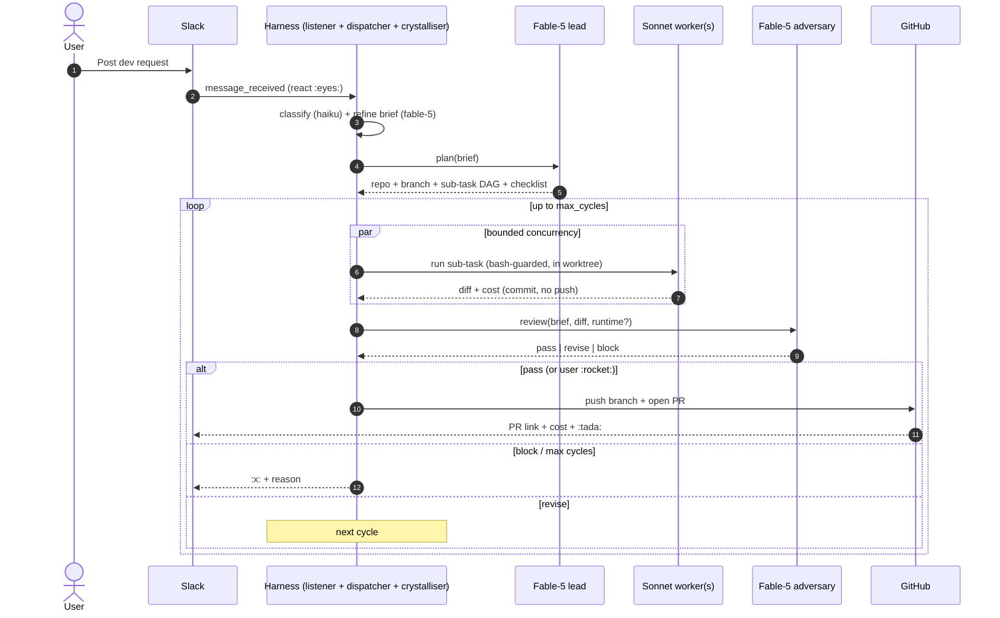

# openclaw-agent-harness

*Multi-agent code-writing harness for OpenClaw.* Hand it a dev request and a Fable-5 lead plans, Sonnet workers write code in isolated git worktrees, and a Fable-5 adversary reviews the diff (with optional runtime logs, see below) before a PR opens under the requester's GitHub identity.

> *Status: beta.* Version `0.1.0-beta.14`. 267 tests green. See `docs/REAL-TEST-RUNBOOK.md` before wiring up a live channel, **`docs/AUTH.md`** for the Anthropic API key and verification contract reference, and **`docs/GITHUB_AUTH.md`** for git provider tokens (GitHub + GitLab, per-user; required in a headless/Docker deployment, else the first session fails at plan phase).
>
> **beta.10 fix:** the 5 new beta.9 optional verify probes (`fileExistsOnDisk`, `fileCommittedSince`, `remoteBranchSha`, `remoteFileExists`, `prForBranch`, `prFiles`, `localHeadSha`) are now provided by the production `buildVerifyProbes` factories in both the loop-path and worker-path. Beta.9 shipped the graceful-skip fallback but no factory was providing the probes, so 5 of 8 contract kinds were pass-as-skipped in real runs. Beta.10 wires them all to real `fs.stat` / `git log` / `git ls-remote` / provider REST calls. See [CHANGELOG](CHANGELOG.md).
>
> **beta.9 fix:** `file_written` verification now uses `fs.stat` (includes untracked files), fixing the beta.8 false-negative that blocked the write→commit→push plan shape. 7 new precise contract kinds added.

### Two ways to drive it

- **Agent-orchestrated (DEFAULT, recommended).** The OpenClaw agent owns the conversation and calls the harness as a set of tools. You talk to your OpenClaw agent; it calls `harness_run` (raw request -> crystallise -> plan -> workers -> adversary -> PR), watches with `harness_status` / `harness_session_get`, and reports back. The plugin does **not** listen to Slack itself. This is the default (`slack.listener_enabled: false`).
- **Autonomous listener (opt-in).** Set `slack.listener_enabled: true` and the plugin subscribes to `message_received` and treats allow-listed messages in `slack.channel` as dev requests directly, bypassing the agent. Useful for a dedicated dev channel, but it competes with your OpenClaw agent for messages, so it's off by default.

Either way the pipeline is identical; only the *entry point* differs.

## Why

Your OpenClaw agent is where dev asks land, and Claude Code is where the actual writing gets done. This plugin closes the loop: crystallise the ask into a brief, plan atomic sub-tasks, execute them in parallel Sonnet subprocesses inside a git worktree, and have a Fable-5 adversary sign off before a PR is opened. The agent orchestrates all of it via tools.

Nothing pushes to a repo until the adversary is satisfied (or a human drops `:rocket:` to override). Nothing pushes at all without a per-repo per-user PAT the requester owns.

## Architecture

Full UML (component, sequence, state) lives in [`docs/ARCHITECTURE.md` §0](docs/ARCHITECTURE.md#0-uml-diagrams). The interaction between the agents, at a glance:



Nothing pushes until the adversary passes (or a human drops `:rocket:`). Reactions (`:rocket:` ship, `:x:` abort, `:moneybag:` budget-bump) are polled every 15s and applied at each loop checkpoint.

## Subsystems (all wired)

| Piece                        | File                                             | Purpose                                                |
| ---------------------------- | ------------------------------------------------ | ------------------------------------------------------ |
| Plugin entry                 | `src/index.ts`                                   | OpenClaw plugin descriptor + `register(api)`           |
| Config parser                | `src/config.ts`                                  | Hard validation, deep-merge defaults                   |
| Config JSON schema           | `src/config.schema.json`                         | Editor / doc integration                               |
| PAT router                   | `src/auth/pat-router.ts`                         | Per-user, per-repo PAT resolution                      |
| Prompt crystalliser          | `src/crystallise/prompt-refiner.ts`              | Classifier -> brief pipeline                           |
| Fable-5 lead                 | `src/orchestrator/fable5-lead.ts`                | Plan validator (allow-list, branch prefix, sub-cap 20) |
| Sonnet worker                | `src/orchestrator/sonnet-worker.ts`              | Runs one sub-task with `canUseTool` guard              |
| Fable-5 adversary            | `src/orchestrator/fable5-adversary.ts`           | Reviews diff, runtime banner, safety-net              |
| Orchestrator loop            | `src/orchestrator/loop.ts`                       | 3-cycle state machine + parallel exec + topo sort      |
| Claude SDK adapter           | `src/adapters/claude-sdk.ts`                     | `@anthropic-ai/claude-agent-sdk` wrappers              |
| Git worktree adapter         | `src/adapters/git-worktree.ts`                   | Allocate/commit/diff/push, per-session isolation       |
| GitHub PR opener             | `src/adapters/github-pr.ts`                      | Push branch, POST /pulls (draft if verdict != pass)   |
| GitHub PR-merged watcher     | `src/adapters/github-watcher.ts`                 | Detects merge/close, releases worktree                 |
| Runtime logs bridge          | `src/vercel/logs.ts`                             | Optional. Vercel bridge (feature-flagged) OR manual upload via `harness_upload_logs`. Adversary refuses to sign off on runtime dimension when no data is present. |
| Slack listener               | `src/slack/channel-listener.ts`                  | Pure `routeMessage()` + UNIQUE thread guard           |
| Slack dispatcher             | `src/slack/dispatcher.ts`                        | Bridges listener -> orchestrator                       |
| Slack reactions reader       | `src/slack/reactions.ts`                         | Authorised-user filter                                 |
| Reactions poller             | `src/slack/reactions-poller.ts`                  | 15s interval, writes into `reactions_json` column      |
| Bash guard                   | `src/safety/bash-guard.ts`                       | Tokeniser-based POSIX-ish denylist                     |
| Budget enforcer              | `src/budgets/enforcer.ts`                        | Daily + monthly USD ledger                            |
| State store                  | `src/state/store.ts` + `schema.sql`              | SQLite (built-in `node:sqlite`), audit log             |
| Retention                    | `src/state/retention.ts`                         | 90-day audit prune, terminal-session prune             |
| Session recovery             | `src/state/recovery.ts`                          | Stale in-flight -> `interrupted`, Slack notify         |
| Tools                        | `src/tools/registration.ts`                      | 9 tools (see below)                                    |

## Tools exposed

- `harness_run` -- **primary agent entry point**: raw request -> crystallise -> start session (returns sessionId, a clarifying question, or a rejection)
- `harness_start_session` -- start from a pre-built structured brief (skips crystallisation); Slack channel/thread optional
- `harness_status` -- active sessions + monthly spend
- `harness_health` -- DB reachable, schema OK, config valid, cred set
- `harness_session_get` -- one session with sub-tasks/reviews/audit
- `harness_telemetry` -- monthly ledger + session cost breakdown
- `harness_upload_logs` -- attach runtime logs from any deploy target (nginx, CloudWatch, on-prem) when Vercel is off
- `harness_cancel` -- set abort flag; loop terminates at next checkpoint
- `harness_resume` -- re-kick an interrupted session with its brief
- `harness_retention_prune` -- manual audit-log prune

## Runtime data (optional, not tied to Vercel)

The adversary reviews *runtime* dimension only when runtime data is available. Two sources are supported:

1. *Vercel bridge* -- `harness.vercel.enabled: true`. The harness polls Vercel deployments for the branch, waits up to `preview_wait_seconds` for a preview to land, and pulls a bounded event-log excerpt.
2. *Manual upload* -- for repos that don't deploy to Vercel. Any authorised user calls `harness_upload_logs` with a session id and a log excerpt (nginx, CloudWatch, on-prem, whatever). The adversary consumes the most-recent upload with `provider: "manual"`.

If neither is available, the adversary is given a `NO RUNTIME DATA` banner and MUST NOT sign off on runtime concerns. It won't silently pass a diff just because it can't see the running system.

## Reactions

Only from `slack.authorised_users`:

- `:rocket:` on a bot message in `reviewing` state -> ship it
- `:x:` -> abort at next checkpoint
- `:pause_button:` -> (planned) pause the session
- `:moneybag:` -> allow session to blow past its per-session budget cap

## Quick start

```bash
git clone https://github.com/CarelvanHeerden/openclaw-agent-harness
cd openclaw-agent-harness
npm ci
npm test        # runs 157 tests
npm run smoke   # boots the plugin against a fake OpenClaw API (both modes)
```

Then follow `docs/REAL-TEST-RUNBOOK.md` for wiring up the real Slack channel and Vault credentials. See `docs/AUTH.md` (Anthropic key) and `docs/GITHUB_AUTH.md` (GitHub token) for the vault-first, env-fallback auth both the model loop and git operations need.

For repeatable smoke tests, `harness_bootstrap_test_repo` creates a fresh disposable repo under your account (seeded with a README + `docs/`) and adds it to the live allow-list, so you never test against the harness's own source.

## Development

- `npm run typecheck` -- strict TS, no `any` leaks in `src/`
- `npm run build` -- emits `dist/` + copies `schema.sql`
- `npm test` -- Node test runner, 136 tests as of `0.1.0-beta.2`
- `npm run smoke` -- post-build bootstrap sanity

CI on every push and PR: `.github/workflows/ci.yml`.

## License

MIT. See `LICENSE`.
