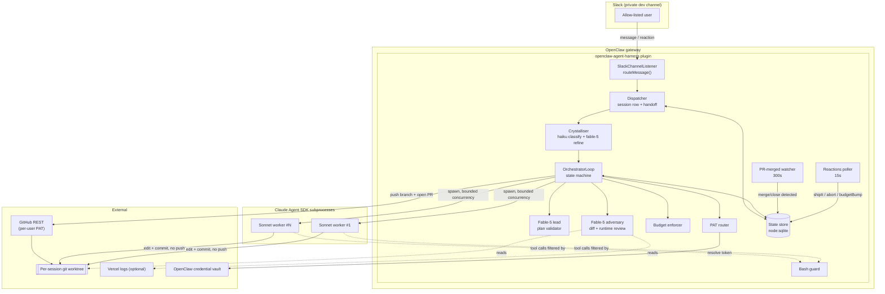
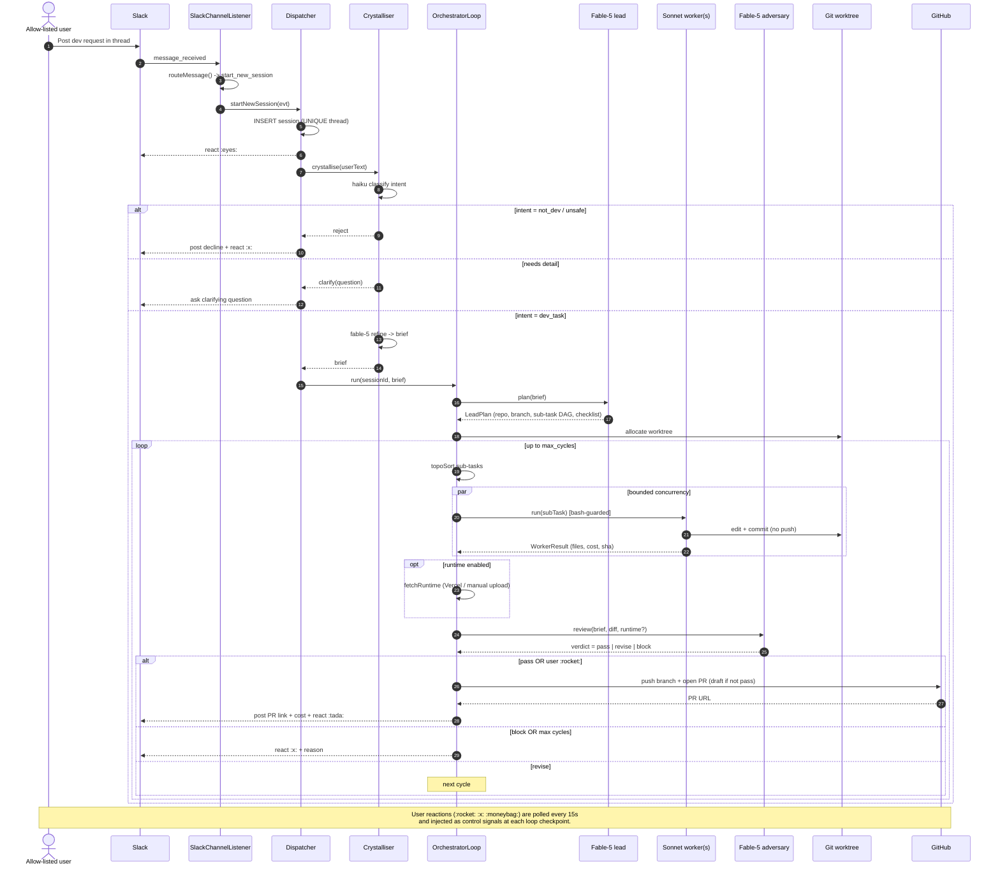
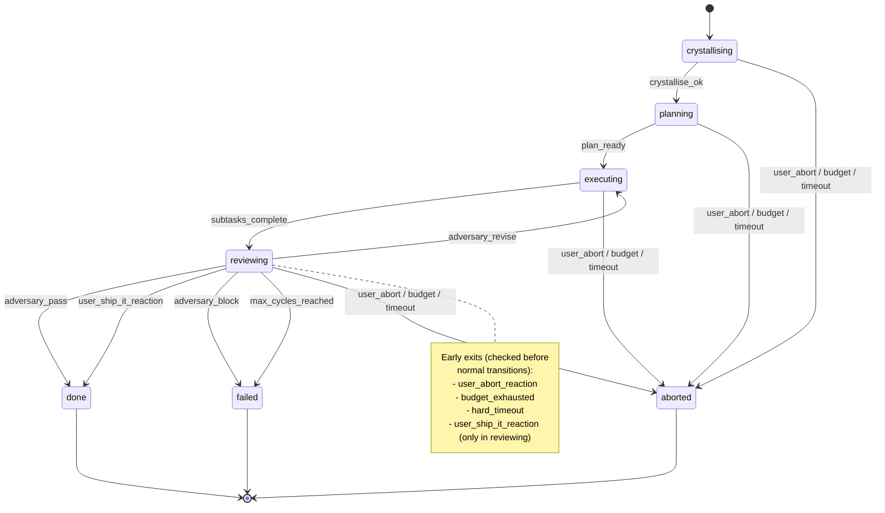

# Architecture

This document describes the design of `openclaw-agent-harness`.

> The diagrams in [§0. UML diagrams](#0-uml-diagrams) are the canonical, always-current
> view of how the agents interact. The ASCII sketches further down are kept as a
> quick-reference and may lag the code; when in doubt, trust the Mermaid diagrams.

---

## 0. UML diagrams

These render natively on GitHub. Source lives inline so they stay in the repo and
version with the code.

### 0.1 Component diagram (who owns what)



### 0.2 Sequence diagram (one dev request, end to end)



### 0.3 State machine (the orchestrator loop)

Mirrors `OrchestratorLoop.advance()` in `src/orchestrator/loop.ts`.



---

## 1. Big picture

```
+-------------------------------------------------------------+
| Slack (private #dev channel, allow-listed users)            |
+-------------------------+-----------------------------------+
                          |
                          v
+-------------------------------------------------------------+
| OpenClaw gateway                                            |
|   |                                                         |
|   +--> openclaw-agent-harness plugin                        |
|         |                                                   |
|         +-- Slack listener  (watches configured channel)    |
|         +-- Intent classifier  (dev task | question | meta) |
|         +-- Prompt crystalliser  (2-3 refinement turns)     |
|         +-- Session state store  (SQLite)                   |
|         +-- Orchestrator                                    |
|         |     +-- Fable-5 lead                              |
|         |     +-- Sonnet workers  (spawned as sub-agents)   |
|         |     +-- Fable-5 adversarial reviewer              |
|         +-- Budget enforcer                                 |
|         +-- PAT router                                      |
|         +-- Git / GitHub bridge                             |
|         +-- Vercel logs bridge  (optional)                  |
+-------------------------------------------------------------+
                          |
                          v
+-------------------------------------------------------------+
| Claude Agent SDK subprocess(es) - one per active session    |
|   working in a per-session git worktree                     |
+-------------------------------------------------------------+
```

---

## 2. Session lifecycle

1. **Intake.** User posts in the configured Slack channel. Non-authorised senders are ignored (or receive a polite decline in DM). The plugin classifies the message with a lightweight intent check.

2. **Crystallisation.** If intent = "dev task", the harness starts a Slack thread and asks up to 3 clarifying questions (repo, acceptance criteria, constraints). The user can override the loop with an explicit "go" reaction. Output: a crystallised prompt (Markdown) stored in the session record.

3. **Plan.** Fable-5 lead reads the crystallised prompt + a repo overview and produces a plan: a DAG of sub-tasks, each with a scope, expected outputs, and a suggested worker model.

4. **Execute.** For each ready sub-task, the lead spawns a Sonnet worker (Claude Agent SDK, own session). Workers get read access to the repo and write access only to their assigned paths (enforced via SDK permission mode + tool whitelist). Workers report structured results back to the lead.

5. **Assemble.** Lead merges worker outputs into a single working diff on a session-scoped git worktree.

6. **Adversarial review.** Fable-5 adversary reads:
   - the crystallised prompt (spec)
   - the current diff
   - the wider codebase (read-only)
   - the latest Vercel preview logs for the branch (if enabled)

   Adversary emits one of: `pass`, `fixes_required(list)`, `reject_and_replan(reason)`.

7. **Loop.** Up to 3 cycles of (execute -> assemble -> review). Early exit on:
   - adversarial `pass`
   - budget ceiling hit (with human handover)
   - user "ship it anyway" reaction (logged)
   - user "abort" reaction

8. **Human review + PR.** On successful exit, the harness pushes the branch under the requester's PAT (per-org routing) and opens a draft PR. The Slack thread gets a summary + PR link + cost breakdown. Human reviews and merges.

---

## 3. Component responsibilities

### 3.1 Slack listener

- Subscribed to a single channel via OpenClaw's Slack plugin.
- Filters by allow-listed user IDs.
- Routes messages to the intent classifier.
- Handles Slack reactions as first-class control signals: `ship_it`, `abort`, `pause`, `budget_bump`.

### 3.2 Intent classifier

- Lightweight Haiku/Sonnet call, or a rule-based first pass.
- Categories: `dev_task`, `question`, `status`, `meta_command`, `noise`.
- Only `dev_task` triggers a session.

### 3.3 Prompt crystalliser

- Multi-turn refinement in the Slack thread.
- Explicit slots to fill: `target_repo`, `acceptance_criteria`, `constraints`, `budget_override?`, `permission_mode?`.
- User can short-circuit with "go" or a `:rocket:` reaction.

### 3.4 Session state store

- SQLite at `~/.openclaw/workspace/openclaw-agent-harness/state.db`.
- Tables: `sessions`, `sub_tasks`, `attempts`, `reviews`, `budgets_daily`, `budgets_monthly`, `audit_log`.
- Every mutation appended to `audit_log` for QSA-friendly traceability.

### 3.5 Fable-5 lead

- One instance per session.
- System prompt: planner + reviewer of worker outputs, not a coder itself.
- Tools: `spawn_worker`, `read_repo`, `write_summary`, `request_adversarial_review`.
- Model: `claude-fable-5`.

### 3.6 Sonnet workers

- Ephemeral Claude Agent SDK sessions.
- Sandboxed to specific paths within the session's git worktree.
- Bash whitelist: `git` (no push), `pnpm`, `npm`, `ls`, `grep`, `cat`, `node`, `jq`, `sed`, `awk`.
- Deny-list: `.secrets/`, `credentials.db`, `.env*`, `~/.claude/`, `memory/credentials*`.
- Model: `claude-sonnet-5`.
- Reports back a structured `WorkerResult` object (files changed, tests added, summary, cost).

### 3.7 Fable-5 adversarial reviewer

- Fresh session per cycle, no prior context except:
  - the crystallised prompt,
  - the current diff,
  - a read-only view of the repo,
  - optional Vercel logs.
- Prompted to be paranoid, terse, and structured.
- Emits a `ReviewReport` with severity-tagged findings.

### 3.8 Budget enforcer

- Tracks spend per session (`total_cost_usd` from every SDK `result` event), per user per day, per user per month.
- Hard-kills sessions that exceed their per-session ceiling.
- Refuses new sessions past the monthly cap unless the user explicitly overrides via a reaction (audit-logged).

### 3.9 PAT router

- On session start, records `(user, target_org)` -> credential service name.
- Fetches token via OpenClaw credential vault at session start; never persists it in plugin state.
- All git operations use the fetched token via short-lived `x-access-token` URL.

### 3.10 Git / GitHub bridge

- Creates a session-scoped git worktree so parallel sessions don't collide.
- Commits attributed to the requester (git config `user.email`, `user.name` from a per-user mapping).
- Push + draft PR via GitHub REST.
- No force-push. No push to `main`.

### 3.11 Vercel logs bridge (optional)

- If a Vercel token is configured, harness fetches preview deploy logs for the current branch after each execute cycle.
- Adversary gets the logs as an extra input.
- Never used to trigger deploys, only to observe.

---

## 4. State schema (SQLite via `node:sqlite`)

> The store uses Node's built-in `node:sqlite` (`DatabaseSync`), not
> `better-sqlite3`. OpenClaw installs plugins with `npm install --ignore-scripts`,
> which skips native build scripts; a built-in module avoids the missing-bindings
> failure entirely. See `src/state/store.ts`.


```sql
CREATE TABLE sessions (
  id              TEXT PRIMARY KEY,
  slack_thread    TEXT NOT NULL,
  slack_channel   TEXT NOT NULL,
  requester       TEXT NOT NULL,      -- Slack user id
  requester_gh    TEXT NOT NULL,      -- GitHub login
  repo            TEXT NOT NULL,      -- e.g. example-org/example-repo
  branch          TEXT NOT NULL,
  worktree_path   TEXT NOT NULL,
  status          TEXT NOT NULL,      -- crystallising|planning|executing|reviewing|done|failed|aborted
  created_at      INTEGER NOT NULL,
  updated_at      INTEGER NOT NULL,
  budget_usd      REAL NOT NULL,
  cost_usd        REAL NOT NULL DEFAULT 0,
  crystallised_prompt TEXT,
  final_pr_url    TEXT
);

CREATE TABLE sub_tasks (
  id              TEXT PRIMARY KEY,
  session_id      TEXT NOT NULL REFERENCES sessions(id),
  cycle           INTEGER NOT NULL,   -- 1..3
  ordinal         INTEGER NOT NULL,
  description     TEXT NOT NULL,
  worker_model    TEXT NOT NULL,
  status          TEXT NOT NULL,      -- pending|running|done|failed
  cost_usd        REAL NOT NULL DEFAULT 0,
  files_touched   TEXT,               -- JSON array
  summary         TEXT,
  created_at      INTEGER NOT NULL,
  updated_at      INTEGER NOT NULL
);

CREATE TABLE reviews (
  id              TEXT PRIMARY KEY,
  session_id      TEXT NOT NULL REFERENCES sessions(id),
  cycle           INTEGER NOT NULL,
  verdict         TEXT NOT NULL,      -- pass|fixes_required|reject_and_replan
  findings        TEXT NOT NULL,      -- JSON
  cost_usd        REAL NOT NULL DEFAULT 0,
  created_at      INTEGER NOT NULL
);

CREATE TABLE budgets_daily (
  day             TEXT NOT NULL,      -- YYYY-MM-DD
  user            TEXT NOT NULL,
  spent_usd       REAL NOT NULL DEFAULT 0,
  PRIMARY KEY (day, user)
);

CREATE TABLE budgets_monthly (
  month           TEXT NOT NULL,      -- YYYY-MM
  user            TEXT NOT NULL,
  spent_usd       REAL NOT NULL DEFAULT 0,
  PRIMARY KEY (month, user)
);

CREATE TABLE audit_log (
  id              INTEGER PRIMARY KEY AUTOINCREMENT,
  session_id      TEXT,
  event           TEXT NOT NULL,
  payload         TEXT NOT NULL,      -- JSON
  created_at      INTEGER NOT NULL
);
```

---

## 5. Failure modes

| Failure | Detection | Response |
|---|---|---|
| Worker times out | SDK client-side timer | Kill worker, mark sub-task failed, lead decides retry vs abandon |
| Adversary times out | SDK client-side timer | Treat as `fixes_required` with a single "review timed out" finding |
| Budget hit mid-cycle | Cost tracker on every `result` event | Freeze session, notify user in Slack thread, ask for override |
| Container restart | Missing PID + no `result` event within grace period | Mark session `interrupted`, expose "resume" action |
| Git push rejected (SAML) | `git push` returncode + stderr grep | Emit `git format-patch` to prompt file, ping user with fallback flow |
| GitHub PAT invalid or missing scope | REST call 401/403 | Fail session at start with clear error listing required scopes |
| Vercel logs unavailable | REST 4xx / no deployment for branch | Adversary runs without runtime input, notes gap in report |

---

## 6. Security model

- Every worker session sees only its own worktree + explicit allow-listed read paths.
- Bash whitelist enforced via SDK permission callback, not just prompt discipline.
- Secrets never enter worker prompts; if a worker needs a secret, the lead resolves it via the vault and passes only the resolved value as a scoped variable.
- Audit log is append-only, timestamped, and retained for 90 days minimum.
- Every session's Claude Agent SDK transcript is preserved under `~/.claude/projects/<encoded-path>/*.jsonl`.
- The plugin itself has broader access (e.g., can read `credentials.db`) than the workers it spawns. This is intentional: the harness sometimes needs to see secrets to inject them selectively, but the workers must not.

---

## 7. Observability

- All sessions surface a live cost line in the Slack thread (updated at most once per 30s to respect rate limits).
- `audit_log` is queryable via a `harness_audit` plugin tool.
- Per-session Markdown report written to `memory/openclaw-agent-harness/YYYY-MM-DD-<session>.md` on completion for later human/QSA review.
