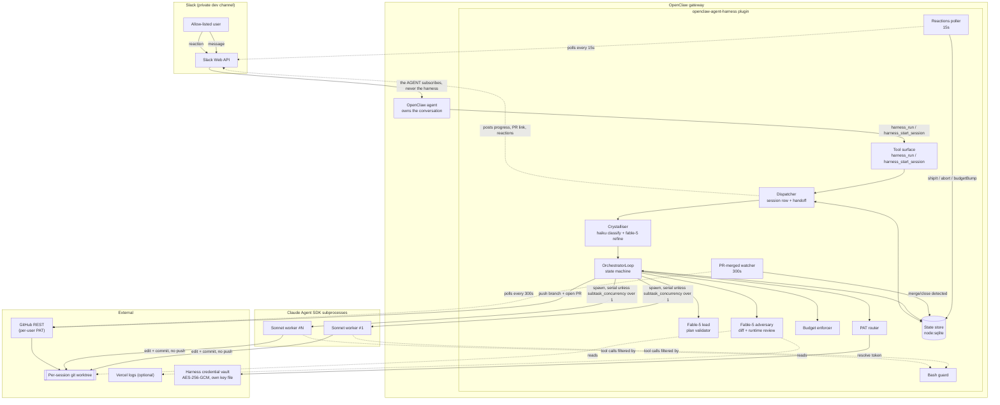
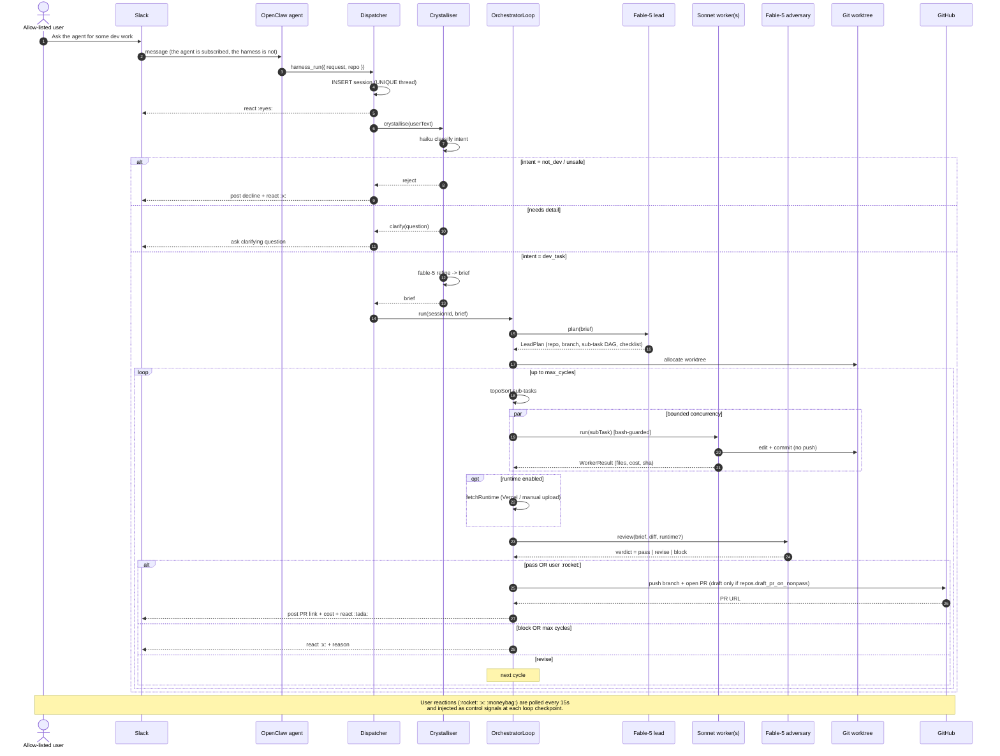
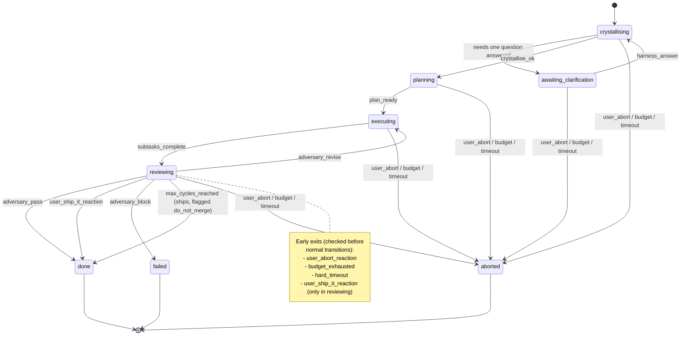

# Architecture

This document describes the design of `openclaw-agent-harness`.

> The diagrams in [§0. UML diagrams](#0-uml-diagrams) show how the agents interact.
> The ASCII sketches further down are a quick reference. Neither is generated, so
> when a diagram and the code disagree, the code wins — through 1.0.0-rc.1 these
> diagrams still drew a Slack listener that was removed in beta.34, and a
> credential vault the harness stopped borrowing in beta.110.

---

## 0. UML diagrams

These render natively on GitHub. Source lives inline so they stay in the repo and
version with the code.

### 0.1 Component diagram (who owns what)


```mermaid
flowchart TB
  subgraph SLACK["Slack (private dev channel)"]
    U["Allow-listed user"]
    API["Slack Web API"]
  end

  subgraph GW["OpenClaw gateway"]
    AGENT["OpenClaw agent\nowns the conversation"]
    subgraph PLUGIN["openclaw-agent-harness plugin"]
      TOOLS["Tool surface\nharness_run / harness_start_session"]
      DIS["Dispatcher\nsession row + handoff"]
      CRY["Crystalliser\nhaiku classify + fable-5 refine"]
      LOOP["OrchestratorLoop\nstate machine"]
      LEAD["Fable-5 lead\nplan validator"]
      ADV["Fable-5 adversary\ndiff + runtime review"]
      BUD["Budget enforcer"]
      PAT["PAT router"]
      GUARD["Bash guard"]
      STORE[("State store\nnode:sqlite")]
      RPOLL["Reactions poller\n15s"]
      PRW["PR-merged watcher\n300s"]
    end
  end

  subgraph WORKERS["Claude Agent SDK subprocesses"]
    W1["Sonnet worker #1"]
    W2["Sonnet worker #N"]
  end

  subgraph EXT["External"]
    GH["GitHub REST\n(per-user PAT)"]
    WT[["Per-session git worktree"]]
    VER["Vercel logs (optional)"]
    VAULT["Harness credential vault\nAES-256-GCM, own key file"]
  end

  U -->|message| API
  API -->|the AGENT subscribes, never the harness| AGENT
  AGENT -->|harness_run / harness_start_session| TOOLS
  U -->|reaction| API
  RPOLL -.->|polls every 15s| API
  DIS -.->|posts progress, PR link, reactions| API
  TOOLS --> DIS
  DIS --> CRY
  CRY --> LOOP
  LOOP --> LEAD
  LOOP -->|spawn, serial unless subtask_concurrency over 1| W1 & W2
  W1 & W2 -->|edit + commit, no push| WT
  LOOP --> ADV
  ADV -.reads.-> WT
  ADV -.reads.-> VER
  LOOP --> BUD
  LOOP --> PAT
  W1 & W2 -.tool calls filtered by.-> GUARD
  PAT -->|resolve token| VAULT
  LOOP -->|push branch + open PR| GH
  GH --> WT
  RPOLL -->|shipIt / abort / budgetBump| STORE
  PRW -.->|polls every 300s| GH
  PRW -->|merge/close detected| STORE
  LOOP <--> STORE
  DIS <--> STORE
```

**Every arrow into the plugin starts inside the gateway.** Slack cannot reach the
harness: the OpenClaw agent is the subscriber, and the only way in is a tool call.
Even reactions are *pulled* — the poller calls the Slack API on a timer, which is
why the arrow points out of the plugin rather than into it. A message posted in
the channel that no agent picks up does nothing at all.

### 0.2 Sequence diagram (one dev request, end to end)


```mermaid
sequenceDiagram
  autonumber
  actor User as Allow-listed user
  participant Slack
  participant Agent as OpenClaw agent
  participant Disp as Dispatcher
  participant Cry as Crystalliser
  participant Orch as OrchestratorLoop
  participant Lead as Fable-5 lead
  participant Worker as Sonnet worker(s)
  participant Adv as Fable-5 adversary
  participant Git as Git worktree
  participant GH as GitHub

  User->>Slack: Ask the agent for some dev work
  Slack->>Agent: message (the agent is subscribed, the harness is not)
  Agent->>Disp: harness_run({ request, repo })
  Disp->>Disp: INSERT session (UNIQUE thread)
  Disp-->>Slack: react :eyes:

  Disp->>Cry: crystallise(userText)
  Cry->>Cry: haiku classify intent
  alt intent = not_dev / unsafe
    Cry-->>Disp: reject
    Disp-->>Slack: post decline + react :x:
  else needs detail
    Cry-->>Disp: clarify(question)
    Disp-->>Slack: ask clarifying question
  else intent = dev_task
    Cry->>Cry: fable-5 refine -> brief
    Cry-->>Disp: brief
    Disp->>Orch: run(sessionId, brief)

    Orch->>Lead: plan(brief)
    Lead-->>Orch: LeadPlan (repo, branch, sub-task DAG, checklist)
    Orch->>Git: allocate worktree

    loop up to max_cycles
      Orch->>Orch: topoSort sub-tasks
      par bounded concurrency
        Orch->>Worker: run(subTask) [bash-guarded]
        Worker->>Git: edit + commit (no push)
        Worker-->>Orch: WorkerResult (files, cost, sha)
      end
      opt runtime enabled
        Orch->>Orch: fetchRuntime (Vercel / manual upload)
      end
      Orch->>Adv: review(brief, diff, runtime?)
      Adv-->>Orch: verdict = pass | revise | block
      alt pass OR user :rocket:
        Orch->>GH: push branch + open PR (draft only if repos.draft_pr_on_nonpass)
        GH-->>Orch: PR URL
        Orch-->>Slack: post PR link + cost + react :tada:
      else block OR max cycles
        Orch-->>Slack: react :x: + reason
      else revise
        Note over Orch: next cycle
      end
    end
  end

  Note over User,GH: User reactions (:rocket: :x: :moneybag:) are polled every 15s<br/>and injected as control signals at each loop checkpoint.
```

### 0.3 State machine (the orchestrator loop)

Mirrors `OrchestratorLoop.advance()` in `src/orchestrator/loop.ts`.


```mermaid
stateDiagram-v2
  [*] --> crystallising
  crystallising --> awaiting_clarification: needs one question answered
  awaiting_clarification --> crystallising: harness_answer
  crystallising --> planning: crystallise_ok
  planning --> executing: plan_ready
  executing --> reviewing: subtasks_complete
  reviewing --> done: adversary_pass
  reviewing --> done: user_ship_it_reaction
  reviewing --> executing: adversary_revise
  reviewing --> failed: adversary_block
  reviewing --> done: max_cycles_reached (ships, flagged do_not_merge)

  crystallising --> aborted: user_abort / budget / timeout
  awaiting_clarification --> aborted: user_abort / budget / timeout
  planning --> aborted: user_abort / budget / timeout
  executing --> aborted: user_abort / budget / timeout
  reviewing --> aborted: user_abort / budget / timeout

  done --> [*]
  failed --> [*]
  aborted --> [*]

  note right of reviewing
    Early exits (checked before
    normal transitions):
    - user_abort_reaction
    - budget_exhausted
    - hard_timeout
    - user_ship_it_reaction (only in reviewing)
  end note
```

---

## 1. Big picture

```
+-------------------------------------------------------------+
| Slack (private #dev channel, allow-listed users)            |
+-------------------------+-----------------------------------+
                          |
              message     |         ^  reactions are POLLED
              (Slack ->   |         |  every 15s, and progress
               the AGENT) v         |  is POSTED back out
+-------------------------------------------------------------+
| OpenClaw gateway                                            |
|   |                                                         |
|   +--> OpenClaw agent  (subscribed to Slack, owns the chat) |
|         |                                                   |
|         |   harness_run / harness_start_session             |
|         |   (a TOOL CALL -- the only way in)                |
|         v                                                   |
|   +--> openclaw-agent-harness plugin                        |
|         |                                                   |
|         +-- Tool surface  (harness_run, 19 tools)           |
|         +-- Intent classifier  (dev_task|clarify|not_dev|   |
|         |                       unsafe)                     |
|         +-- Prompt crystalliser  (single pass)              |
|         +-- Session state store  (SQLite)                   |
|         +-- Orchestrator                                    |
|         |     +-- Fable-5 lead                              |
|         |     +-- Sonnet workers  (spawned as sub-agents)   |
|         |     +-- Fable-5 adversarial reviewer              |
|         +-- Budget enforcer                                 |
|         +-- PAT router                                      |
|         +-- Git / GitHub bridge                             |
|         +-- Vercel logs bridge  (optional)                  |
+-------------------------------------------------------------+
                          |
                          v
+-------------------------------------------------------------+
| Claude Agent SDK subprocess(es) - one per active session    |
|   working in a per-session git worktree                     |
+-------------------------------------------------------------+
```

---

## 2. Session lifecycle

1. **Intake.** One entry point: the OpenClaw agent calls the `harness_run` tool with a raw request (or `harness_start_session` with a pre-built brief). The plugin does not listen to Slack — beta.34 removed the autonomous listener, and beta.133 dropped `slack.listener_enabled` from the parsed config altogether. `harness_run` runs the classifier + crystalliser itself and either starts a session, returns a clarifying question for the agent to relay, or rejects.

   The requester must be in `slack.authorised_users`, and the request is classified with a lightweight intent check before anything runs.

2. **Crystallisation.** If intent = `dev_task`, one crystalliser call turns the request into a structured brief (repo, acceptance criteria, constraints). Where it needs more, it returns **one** clarifying question for the calling agent to relay — answered with `harness_answer`, not a multi-turn Slack loop. Output: a crystallised prompt stored in the session record.

3. **Plan.** Fable-5 lead reads the crystallised prompt + a repo overview and produces a plan: a DAG of sub-tasks, each with a scope, expected outputs, and a suggested worker model.

4. **Execute.** For each ready sub-task, the lead spawns a Sonnet worker (Claude Agent SDK, own session). Workers get read access to the repo and write access only to their assigned paths (enforced via SDK permission mode + tool whitelist). Workers report structured results back to the lead.

5. **Assemble.** Lead merges worker outputs into a single working diff on a session-scoped git worktree.

6. **Adversarial review.** Fable-5 adversary reads:
   - the crystallised prompt (spec)
   - the current diff
   - the wider codebase (read-only)
   - the latest Vercel preview logs for the branch (if enabled)

   Adversary emits one of: `pass`, `revise` (with findings), `block`.

7. **Loop.** `loop.max_cycles` cycles of (execute -> review), 3 by default, extendable
   once via `loop.max_cycle_extensions`. Early exit on:
   - adversarial `pass`
   - budget ceiling hit (with human handover)
   - user "ship it anyway" reaction (logged)
   - user "abort" reaction

   Reaching the ceiling with findings still outstanding usually **ships** rather than
   fails: the run opens a PR flagged `do_not_merge` and audits
   `shipped_max_cycles_revise`. A `block` verdict is what ends a run without one.

8. **Human review + PR.** On successful exit, the harness pushes the branch under the
   requester's PAT (per-org routing) and opens a PR — not a draft, unless
   `repos.draft_pr_on_nonpass` is set and the verdict was not `pass`. The Slack thread
   gets a summary + PR link + cost breakdown. Human reviews and merges.

---

## 3. Component responsibilities

### 3.1 Slack message router (never subscribed)

- **The plugin does not listen to Slack.** beta.34 removed the autonomous listener and beta.133 dropped `slack.listener_enabled` from the parsed config entirely; a legacy config that still sets it gets a one-time warning at bootstrap and is otherwise unaffected. The OpenClaw agent drives everything via the `harness_run` / `harness_start_session` tools.
- `src/slack/channel-listener.ts` survives as a pure router with a UNIQUE thread guard, used for inbound events handed to it explicitly rather than any subscription of its own.
- Filters by allow-listed user IDs.
- Routes messages to the intent classifier.
- Slack reactions remain first-class control signals where a real channel binding exists: `ship_it`, `abort`, `pause`, `budget_bump`. Agent-orchestrated sessions carry an `agent:<uuid>` thread with no channel, so they are driven by verdicts and `harness_answer` instead.

### 3.2 Intent classifier

- One `models.classifier` call (default `claude-haiku-4-5`). There is no rule-based first pass.
- Categories: `dev_task`, `clarify`, `not_dev`, `unsafe`.
- Only `dev_task` proceeds to crystallisation. `clarify` returns a single question for the
  agent to put to the user; `not_dev` and `unsafe` decline.

### 3.3 Prompt crystalliser

- A single pass, not a conversation: one classifier call followed by one crystalliser call.
  The crystalliser uses `models.lead` rather than a model key of its own.
- Produces a structured brief (`acceptanceCriteria`, `repoHint` and friends) as JSON.
- Where it needs more from the user it returns **one** clarifying question, which the
  calling agent relays and answers via `harness_answer`. It does not run a multi-turn
  slot-filling loop in a Slack thread.

### 3.4 Session state store

- SQLite at `~/.openclaw/workspace/openclaw-agent-harness/state.db`.
- Tables: `sessions`, `sub_tasks`, `reviews`, `budgets_daily`, `budgets_monthly`,
  `audit_log`, `runtime_uploads`, `credential_routes`. `src/state/schema.sql` is the
  authoritative definition; see §4.
- Significant lifecycle events are appended to `audit_log`. It is an event log rather
  than a change-data-capture of every UPDATE — the exhaustive trail is the interaction
  log (`harness_logs`).

### 3.5 Fable-5 lead

- One instance per session.
- A structured planning call, not an agent with a tool belt: `runLeadPlanner` returns a
  JSON `LeadPlan` (repo, branch, sub-task DAG, verify contracts). It holds no
  `spawn_worker` or `read_repo` tools — scheduling belongs to `OrchestratorLoop`, which
  dispatches workers from the plan and calls the lead again to re-plan.
- Before planning it may take a bounded scout turn over the repository
  (`loop.lead_repo_scout_enabled`), because a lead that has read nothing plans against
  files it imagined.
- Model: `claude-fable-5`.

### 3.6 Sonnet workers

- Ephemeral Claude Agent SDK sessions.
- Sandboxed to specific paths within the session's git worktree.
- Bash whitelist (`safety.bash_whitelist`): around fifty base commands — the git/package/language toolchain (`git`, `npm`, `pnpm`, `yarn`, `node`, `tsc`, `python`, `pytest`, `go`, `cargo`, `make`) and read-only shell utilities (`ls`, `cat`, `rg`, `jq`, `sed`, `awk`, `find`). Shells themselves are excluded as base commands *and* denied as argument tokens, because `xargs sh -c`, `find -exec bash` and `env sh` otherwise smuggle an unguarded shell through a whitelisted host. `git push` is governed separately by `safety.allow_git_push`, which is `false` by default. See `src/config.ts` for the authoritative list.
- Path deny-list (`safety.path_denylist`): `.env`, `.env.*`, `.secrets/`, `/etc/`, `/root/`, `~/.ssh/`, `id_rsa`, `id_ed25519`, `harness-vault/`, `vault.key`, `vault.db`. The last three keep a worker out of the harness's own credential vault. The deny-list is enforced on the Read/Write/Edit tools; bash arguments are not path-checked, which is why the whitelist above is narrow and `bash_denylist_tokens` exists as the hard guard.
- Vault key material never reaches the worker environment at all: `OAH_VAULT_KEY` and `OAH_VAULT_KEY_FILE` are stripped from the subprocess env, and renaming the key variable via `credentials.key_env` moves the strip with it.
- Model: `claude-sonnet-5`.
- Workers run **serially by default**: concurrency needs both `loop.subtask_concurrency > 1`
  and `loop.parallel_independent_subtasks`.
- Reports back a structured `WorkerResult` (`filesChanged`, commit SHAs, status, token
  and cost metrics).

### 3.7 Fable-5 adversarial reviewer

- Fresh session per cycle, no prior context except:
  - the crystallised prompt,
  - the current diff,
  - a read-only view of the repo,
  - optional Vercel logs.
- Prompted to be paranoid, terse, and structured.
- Emits a `ReviewReport` with severity-tagged findings.

### 3.8 Budget enforcer

- Tracks spend per session (`cost_usd`, accumulated from every SDK `result` event), per user per day, per user per month.
- A session that overruns its own ceiling **warns**; it is the daily and monthly caps that stop work. Treat the per-session budget as a tripwire, not a kill switch.
- Refuses new sessions past a cap unless the user overrides with the `:moneybag:` reaction (audit-logged), which lifts the daily cap for the run in flight.

### 3.9 PAT router

- On session start, records `(user, target_org)` -> credential service name.
- Fetches the token from the harness's own vault at session start; never persists it in plugin state. Routes are per `(provider, org, person)` in `credential_routes`, written by `harness_onboard` — not one flat token per person.
- All git operations use the fetched token via short-lived `x-access-token` URL.

### 3.10 Git / GitHub bridge

- Creates a session-scoped git worktree so parallel sessions don't collide.
- Commits attributed to the requester (git config `user.email`, `user.name` from a per-user mapping).
- Push + draft PR via GitHub REST.
- No force-push. No push to `main`.

### 3.11 Vercel logs bridge (optional)

- If a Vercel token is configured, harness fetches preview deploy logs for the current branch after each execute cycle.
- Adversary gets the logs as an extra input.
- Never used to trigger deploys, only to observe.

---

## 4. State schema (SQLite via `node:sqlite`)

> The store uses Node's built-in `node:sqlite` (`DatabaseSync`), not
> `better-sqlite3`. OpenClaw installs plugins with `npm install --ignore-scripts`,
> which skips native build scripts; a built-in module avoids the missing-bindings
> failure entirely. See `src/state/store.ts`.

**`src/state/schema.sql` is the definition; read it there.** The sketch below is a
shape guide, deliberately partial, and it has been wrong before: through 1.0.0-rc.1 it
listed an `attempts` table that has never existed, omitted `runtime_uploads` and
`credential_routes`, called `sub_tasks.seq` "ordinal", and gave the adversary a verdict
vocabulary the code does not use. A schema copied into prose is a schema that drifts, so
treat this as orientation and the SQL file as truth.

Tables: `sessions`, `sub_tasks`, `reviews`, `budgets_daily`, `budgets_monthly`,
`audit_log`, `runtime_uploads`, `credential_routes`.

Session statuses include `crystallising`, `planning`, `executing`, `reviewing`,
`awaiting_clarification`, `resumable`, `interrupted`, `done`, `failed` and `aborted` —
the last four matter to recovery, which sweeps unfinished sessions on boot.

```sql
-- Orientation only. Columns are omitted; see src/state/schema.sql.
CREATE TABLE sessions (
  id              TEXT PRIMARY KEY,
  slack_thread    TEXT NOT NULL,
  slack_channel   TEXT NOT NULL,
  requester       TEXT NOT NULL,      -- Slack user id
  requester_gh    TEXT NOT NULL,      -- GitHub login
  repo            TEXT NOT NULL,      -- e.g. example-org/example-repo
  branch          TEXT NOT NULL,
  worktree_path   TEXT NOT NULL,
  status          TEXT NOT NULL,      -- see the status list above
  created_at      INTEGER NOT NULL,
  updated_at      INTEGER NOT NULL,
  budget_usd      REAL NOT NULL,
  cost_usd        REAL NOT NULL DEFAULT 0,
  crystallised_prompt TEXT,
  final_pr_url    TEXT
);

CREATE TABLE sub_tasks (
  id              TEXT PRIMARY KEY,
  session_id      TEXT NOT NULL REFERENCES sessions(id),
  cycle           INTEGER NOT NULL,
  seq             INTEGER NOT NULL,
  description     TEXT NOT NULL,
  worker_model    TEXT NOT NULL,
  status          TEXT NOT NULL,      -- pending|running|done|failed|interrupted
  cost_usd        REAL NOT NULL DEFAULT 0,
  files_touched   TEXT,               -- JSON array
  summary         TEXT,
  created_at      INTEGER NOT NULL,
  updated_at      INTEGER NOT NULL
);

CREATE TABLE reviews (
  id              TEXT PRIMARY KEY,
  session_id      TEXT NOT NULL REFERENCES sessions(id),
  cycle           INTEGER NOT NULL,
  verdict         TEXT NOT NULL,      -- pass|revise|block
  findings        TEXT NOT NULL,      -- JSON
  cost_usd        REAL NOT NULL DEFAULT 0,
  created_at      INTEGER NOT NULL
);

CREATE TABLE budgets_daily (
  day             TEXT NOT NULL,      -- YYYY-MM-DD
  user            TEXT NOT NULL,
  spent_usd       REAL NOT NULL DEFAULT 0,
  PRIMARY KEY (day, user)
);

CREATE TABLE budgets_monthly (
  month           TEXT NOT NULL,      -- YYYY-MM
  user            TEXT NOT NULL,
  spent_usd       REAL NOT NULL DEFAULT 0,
  PRIMARY KEY (month, user)
);

CREATE TABLE audit_log (
  id              INTEGER PRIMARY KEY AUTOINCREMENT,
  session_id      TEXT,
  event           TEXT NOT NULL,
  payload         TEXT NOT NULL,      -- JSON
  created_at      INTEGER NOT NULL
);
```

---

## 5. Failure modes

| Failure | Detection | Response |
|---|---|---|
| Worker times out | SDK client-side timer | Kill worker, mark sub-task failed, lead decides retry vs abandon |
| Adversary times out | SDK client-side timer | Audit `loop.adversary_timeout` + `loop.review_failed`, then the review-crash path. With `loop.graceful_pr_on_review_crash` (default on) and work already committed, it still opens a PR marked `needs_human_review` rather than discarding the cycle |
| Budget hit mid-cycle | Cost tracker on every `result` event | Freeze session, notify user in Slack thread, ask for override |
| Container restart | Missing PID + no `result` event within grace period | Mark session `interrupted`, expose "resume" action |
| Git push rejected (SAML) | `git push` returncode + stderr grep | Emit `git format-patch` to prompt file, ping user with fallback flow |
| GitHub PAT invalid or missing scope | REST call 401/403 | Fail session at start with clear error listing required scopes |
| Vercel logs unavailable | REST 4xx / no deployment for branch | Adversary runs without runtime input, notes gap in report |

---

## 6. Security model

- Every worker session sees only its own worktree + explicit allow-listed read paths.
- Bash whitelist enforced via SDK permission callback, not just prompt discipline.
- Secrets never enter worker prompts; if a worker needs a secret, the lead resolves it via the vault and passes only the resolved value as a scoped variable.
- Audit log is append-only, timestamped, and retained for 90 days minimum.
- Every session's Claude Agent SDK transcript is preserved under `~/.claude/projects/<encoded-path>/*.jsonl`.
- The plugin process can open the harness vault; worker subprocesses cannot. That gap is deliberate and enforced twice over — `safety.path_denylist` blocks `harness-vault/`, `vault.key` and `vault.db` on the file tools, and the vault key variables are stripped from the worker environment — because the harness sometimes needs to resolve a secret in order to hand a worker only its resolved value.

---

## 7. Observability

- All sessions surface a live cost line in the Slack thread (updated at most once per 30s to respect rate limits).
- `harness_progress` is the one to poll: phase, per-sub-task status, running cost against
  budget, PR and deploy state, and a ready-to-post headline. Relay the terminal headline
  verbatim — a `do_not_merge` PR that reads as plain "Done" gets merged by mistake.
- `harness_logs` reads the durable interaction log (JSONL under `<dataDir>/logs`), which
  is the complete SDK/state trail and survives worktree teardown and container restarts.
  `harness_session_get` gives the session row and its sub-tasks; `harness_telemetry`
  aggregates. There is no `harness_audit` tool — `audit_log` is a table, readable through
  those tools or directly with SQLite.
- Run `harness_help` for the current tool surface rather than trusting a list in prose.
