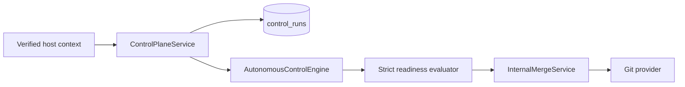
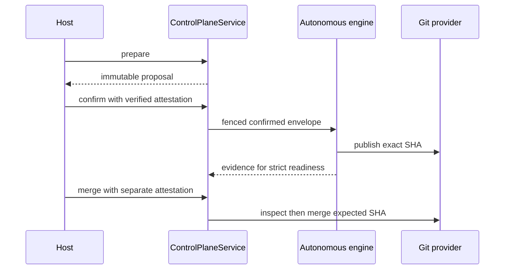
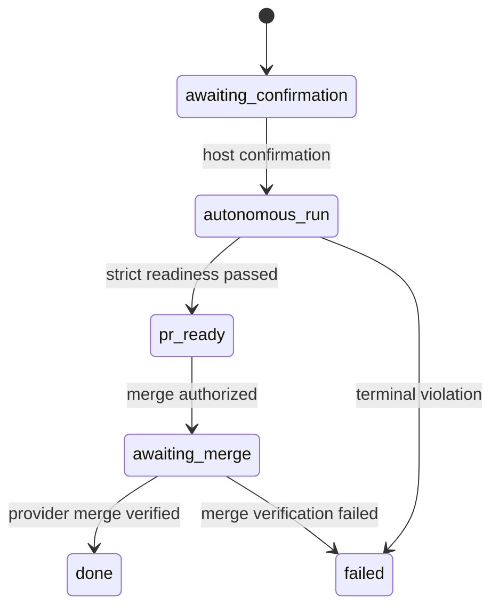

# Architecture

The public surface has four tools: prepare, confirm, result, and merge. `control_runs` is the only live state machine. `ControlPlaneService` creates immutable proposals, consumes host-verified attestations, and owns durable fenced dispatch intents. `AutonomousControlEngine` applies authority decisions and the single strict readiness evaluator. `InternalMergeService` re-inspects the current PR and reconciles durable provider intents.

Legacy session rows are historical execution evidence only. Startup does not recover them or start reaction, answer, revise, or progress services.

```mermaid
flowchart LR
  Host[Verified host context] --> Service[ControlPlaneService]
  Service --> Runs[(control_runs)]
  Service --> Engine[AutonomousControlEngine]
  Engine --> Readiness[Strict readiness evaluator]
  Readiness --> Merge[InternalMergeService]
  Merge --> Provider[Git provider]
```

```mermaid
sequenceDiagram
  participant H as Host
  participant C as ControlPlaneService
  participant E as Autonomous engine
  participant P as Git provider
  H->>C: prepare
  C-->>H: immutable proposal
  H->>C: confirm with verified attestation
  C->>E: fenced confirmed envelope
  E->>P: publish exact SHA
  E-->>C: evidence for strict readiness
  H->>C: merge with separate attestation
  C->>P: inspect then merge expected SHA
```

```mermaid
stateDiagram-v2
  [*] --> awaiting_confirmation
  awaiting_confirmation --> autonomous_run: host confirmation
  autonomous_run --> pr_ready: strict readiness passed
  autonomous_run --> failed: terminal violation
  pr_ready --> awaiting_merge: merge authorized
  awaiting_merge --> done: provider merge verified
  awaiting_merge --> failed: merge verification failed
```
